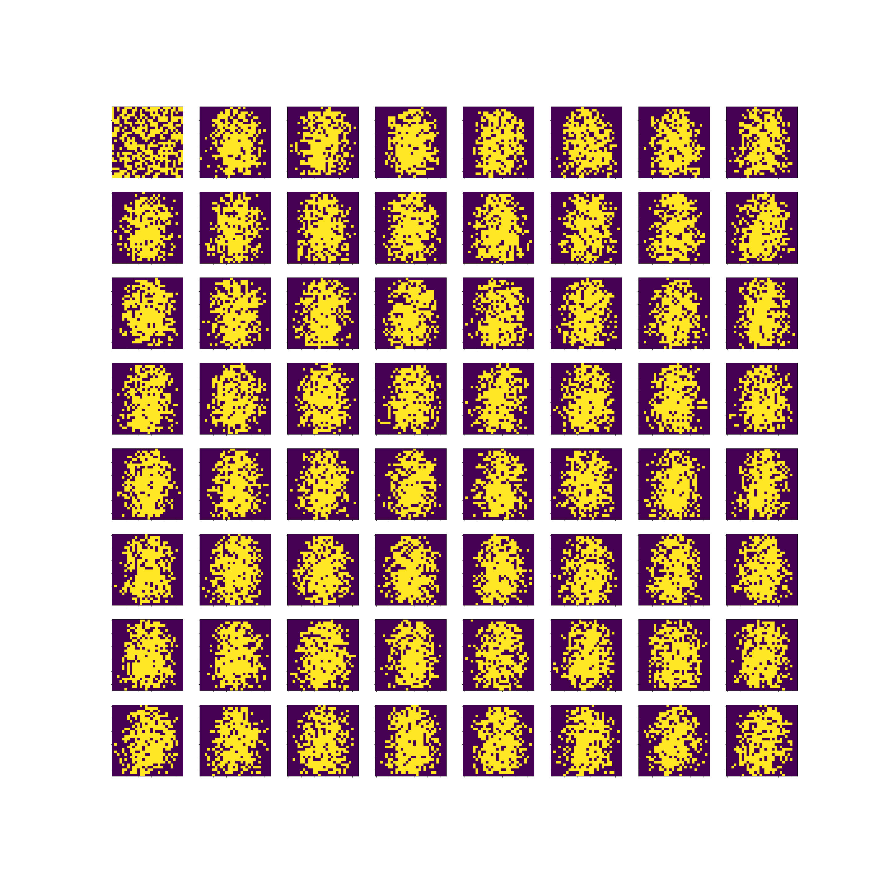
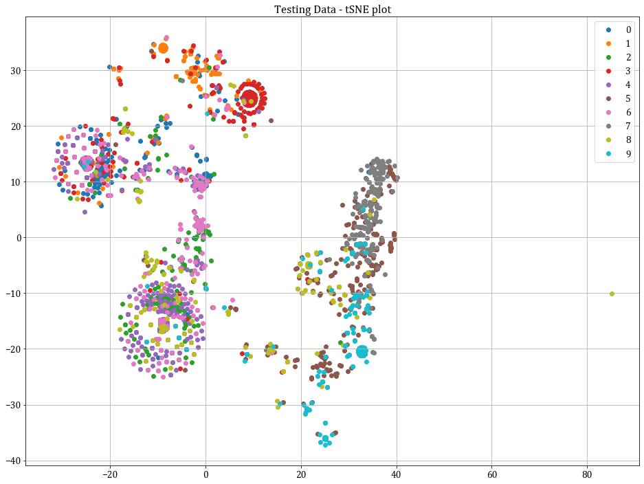

# CS6910-Deep-Learning-Assignment-4
Assignment 4 submission for the course CS6910 Fundamentals of Deep Learning.

Team members: N Sowmya Manojna (BE17B007), Shubham Kashyapi (MM16B027)

## 1. RBM Model
The RBM model is made modular by implementing a `RBM` class.  

Instances of the class can be created by specifying the number of visible and hidden nodes.  

- `num_visible`
- `num_hidden`

The member functions of the class are as follows:

| Function Name | Description | 
|:--------------|:------------|
| `check_data_format` | Checks the format and dimensions of the data. |
| `get_hidden_rep` | Given the visible variables, computes the hidden representation using sampling. |
| `get_visible_rep` | Given the hidden variables, computes the visible representation using sampling. |
| `train_Gibbs_Sampling` | Function that performs one epoch of training using Block Gibbs Sampling. Weights are updated after processing each training sample. |
| `sigmoid` | Given an input array, calculates the sigmoid of the same. |
| `sample_h_vec` | Calculates the hidden variables (vector) from the visible variables (vector). |
| `sample_v_vec` | Calculates the visible variables (vector) from the hidden variables (vector). |
| `sample_h` | Calculates the hidden variables (matrix) from the visible variables (matrix). |
| `sample_v` | Calculates the visible variables (matrix) from the hidden variables (matrix). |
| `kstep_cd` | Performs `k` step contrastive divergence. |
| `get_grads` | Calculates the gradients of the weights and biases. |
| `get_loss` | Calculates the reconstruction loss. |
| `train_contrastive_divergence` | Function that trains the RBM model using contrastive divergence, given the input data, number of epochs, eta. |
| `train` | A wrapper function that encapsulates the `train_Gibbs_Sampling` and `train_contrastive_divergence` functions. |

## 2. Training (without wandb)
The model can be trained using the `train()` method.  
Code samples illustrating the same for CD and BGS are given below:

```python
epochs = 10
num_visible_vars = 784
num_hidden_vars = 256
num_steps_converge = 30
CD_etas = 0.1
train_type = "CD"

model = RBM(num_visible=num_visible_vars, num_hidden=num_hidden_vars)
model.train(input_data=X_train, train_type=train_type, epochs=epochs, \
            k=num_steps_converge, eta=CD_etas)
```

```python
epochs = 10
num_visible_vars = 784
num_hidden_vars = 256
k = 200
r = 30
eta = 1e-4
train_type = "BGS"

model = RBM(num_visible=num_visible_vars, num_hidden=num_hidden_vars)
for epoch_num in range(epochs):
            model.train(input_data=X_train, train_type=train_type, \
                        k = k, r = r, eta = eta)
```

The `train_type` can be specified as:

- `CD` for Contrastive Divergence
- `BGS` for Block Gibbs Sampling

## 3. Training (with wandb)
```python
sweep_config = {'name': 'k_30', 'method': 'grid'}
sweep_config['metric'] = {'name': 'val_acc', 'goal': 'maximize'}
parameters_dict = {
                   'num_hidden_vars': {'values': [64, 128, 256]}, # n
                   'num_steps_converge': {'values': [30]}, # k
                   'CD_etas': {'values': [0.001, 0.005, 0.01, 0.1]}, # eta
                  }
sweep_config['parameters'] = parameters_dict

sweep_id = wandb.sweep(sweep_config, project = 'DL-Assignment4-Q5')
wandb.agent(sweep_id, function = RBM_wandb_logs)
```

The function `RBM_wandb_logs` has been declared inside the respective notebooks.

## 4. Sample image plots (Q6)
The 8 x * grid of images is given below.


## 5. tSNE plot (Q7)
The tSNE plot was obtained using the `sklearn.manifold.TSNE` module. The plot obtained is as follows:


## 6. Report
The wandb report can be accessed [here](https://wandb.ai/cs6910-team/assignment-4/reports/CS6910-Assignment-4--Vmlldzo3MTYyMzU).
